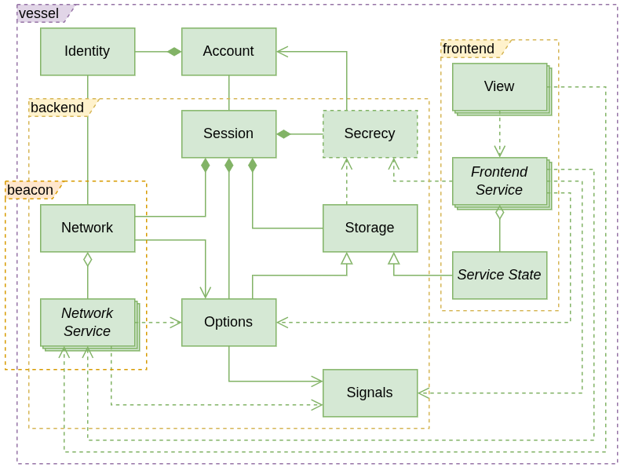
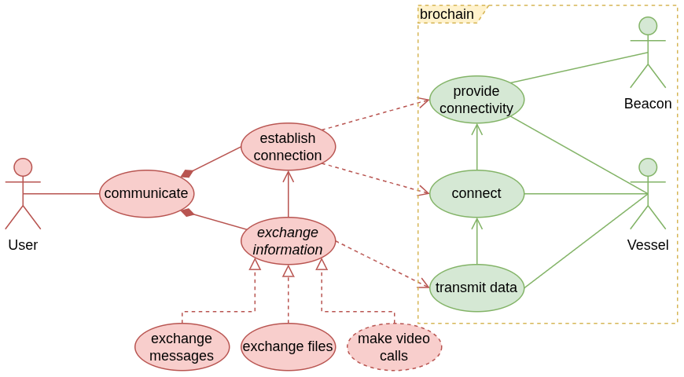
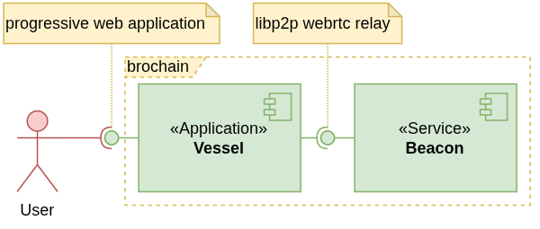
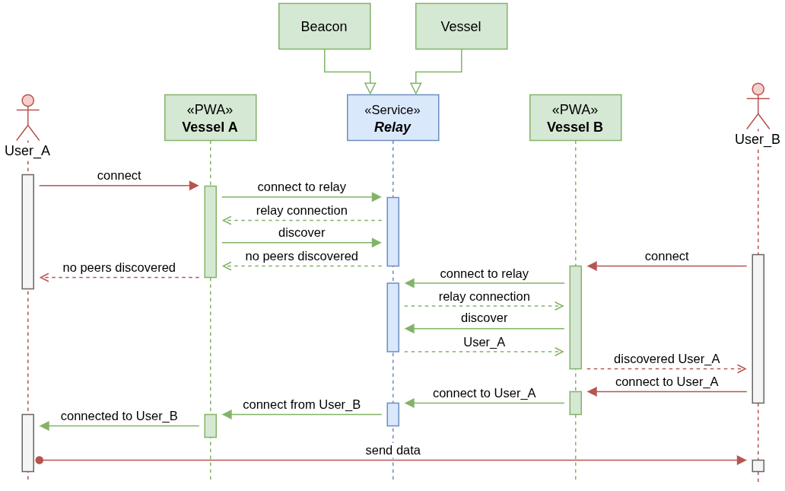
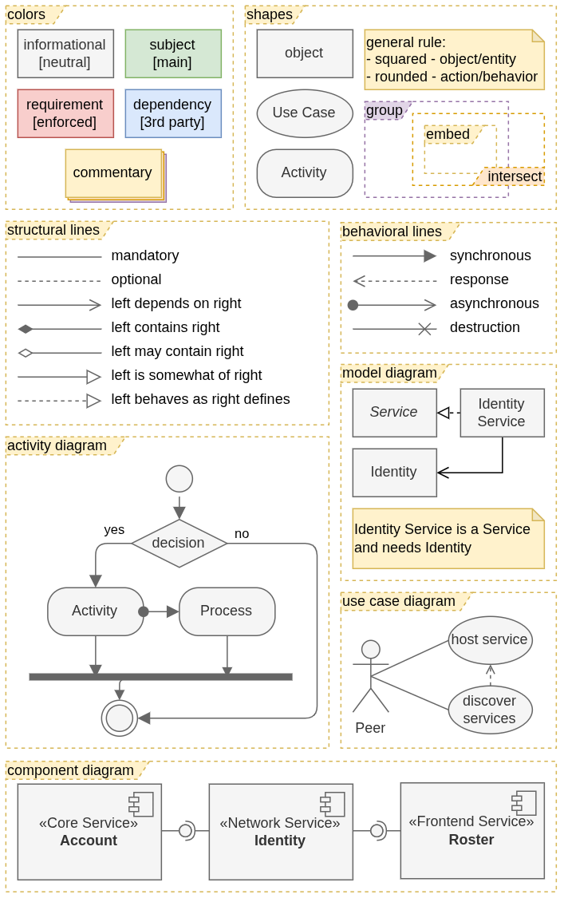

this document defines the engineer-guided semantic architecture and architectural direction.

intended architecture is described here, while [ARCHITECTURE.md](../ARCHITECTURE.md) records implemented reality.

architecture
============

this section contains description of project's architecture without any specifics on its functionality.

brochain
========

this section describes project's functionality, structure and behavior starting from the highest possible level of abstraction.

structure
---------

behavior
--------

appendix
========

how to read
-----------

some additional information on UML notation:

 - diagrams represent semantic structure rather than formal, so "Service State is a Storage" relationship and "Options is a Storage" relationship mean that both entities (even though first is still abstract) provide Storage capabilities; semantic aspect removes necessity of such relationship to enforce any coding rules like actual inheritance of Options interface from Storage
 - red optional dependency generally means that system should aim to make it mandatory
   - such dependency is optional because wherever this request comes from means that requestor either has alternative services they can use or provided service is not captivating enough
   - making such dependency mandatory forces requestor of the service to use this service instead of alternatives
 - when on opposite side of aggregation rhombus is plural entity it means 1-to-n relationship with default constraints `0..infinity`, otherwise it means optional composition (object may be part of owner)
 - constraints may be arbitrarily specified to provide additional information, but are mostly avoided as unnecessary complexity
 - intersecting frames represent overlapping but not necessarily dependent scopes; entities inside the intersection belong to both scopes; if a smaller frame is not fully embedded into a bigger one, it should not be considered part of the bigger scope.
 - shapes with dashed border are not yet considered for implementation or may be implemented as external plugins (non-core entities/behaviors)

naming
------------------

format: `{scope}[.{package}][/{modifier}].{type}`

 - `scope` - application of the diagram:
   - `architecture` - diagram describes general architecture
   - `project` (or `brochain`) - diagram is related specifically to project
   - `development_process` - diagram describes development process
 - `package` - more fine grained definition of application - one or more stanzas dot separated, e.g. `backend.network.services`, `frontend`, etc...
 - `modifier` - additional modifier stanza to application, e.g. `temporary`, `poc`, `option1`, etc...
 - `type` - main type of the diagram:
   - `model` - entity relationship - structural
   - `component` - system decomposition - structural
   - `uc` - use cases / functional decomposition - behavioral
   - `seq` - sequence of component interactions - behavioral
   - `flow` - activity / procedure decomposition - behavioral